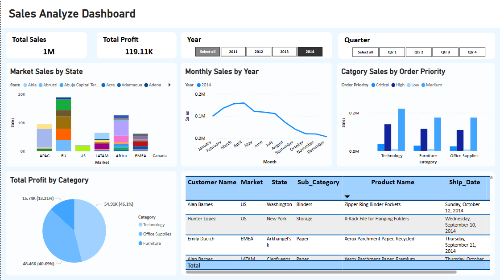
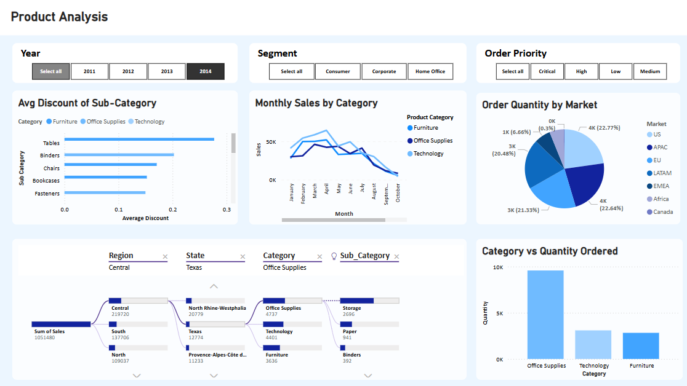

# 📊 Power BI Sales & Product Analysis Dashboards

These dashboards showcase advanced Power BI capabilities for sales and product data analysis, focusing on interactive visuals and dynamic filtering to empower better business decisions.

## 📁 Dashboards Included

1. **Sales Analysis Dashboard**
   - Tracks total sales & profits
   - Filters by year and quarter
   - Breakdowns by state, market, order priority
   - Monthly sales trend visualization
   - Customer-level sales insights

2. **Product Analysis Dashboard**
   - Average discount by sub-category
   - Monthly sales by product category
   - Order quantity by global market
   - Drill-down sales flow from region → category
   - Quantity ordered by category

## 🧰 Tools Used
- Microsoft Power BI
- DAX Measures
- Power Query Editor
- Data Modeling with Relationships

## 💡 Key Features
- Interactive slicers (Year, Quarter, Segment)
- Pie, Bar, Line, and Sankey visuals
- Drill-down and cross-filter capabilities
- Dynamic metrics and conditional formatting

## 📷 Preview

### Sales Dashboard

### Product Dashboard

---

## 📬 Contact
For collaborations or freelance Power BI projects, reach out at [your-email@example.com].

